# MI APP

ABACCO es una aplicacion móvil para IOS que optimiza la labor de gestión de una banda de música.

# Descripción
En abacco podemos encontrar un menú principal donde poder ver las novedades, las partituras y los eventos disponibles. 
Si eres usuario administrador además podras añadir nuevos eventos, noticias y partituras, podras eliminarlas también y dotar 
a otros usuarios como administradores.

Se puede interactúar con otros usuarioas a través de la sección de comentarios en el apartado de noticias, descargar y visualizar 
las partituras y confirmar o rechazar la asistencia a un evento. 

Podremos ver que usuarios ya han confirmado la asistencia y abrir el maps para que nos guía hasta el lugar de encuentro.

También disponemos de una pequeña sección de estadísticas en la que podremos ver a la cantidad de ensayos/actuaciones que hemos asistido.

A continuacion podremos ver algunas imágenes de la interfaz de usuario de la aplicación desde un perfil administrador. 
(Todos los datos que se muestran son ficticios)

## Página de Login y Registro

  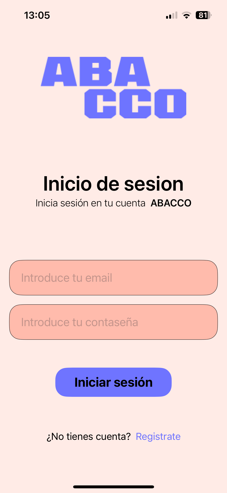
  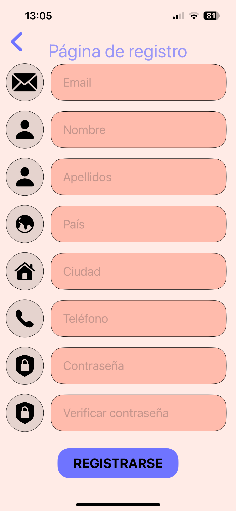

## Menú principal y menú desplazable

  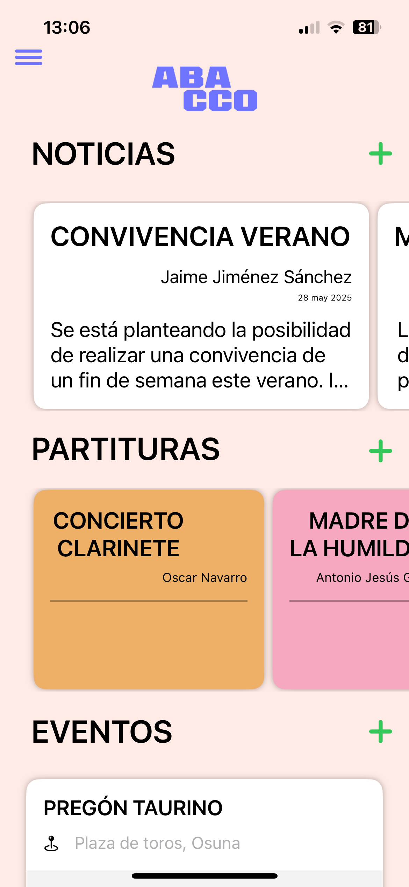
  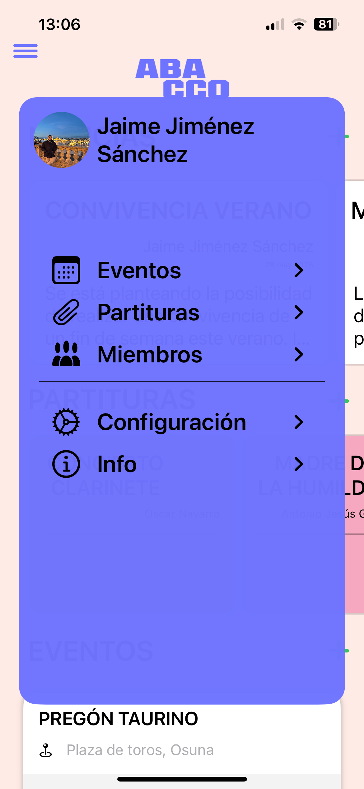

## Perfil
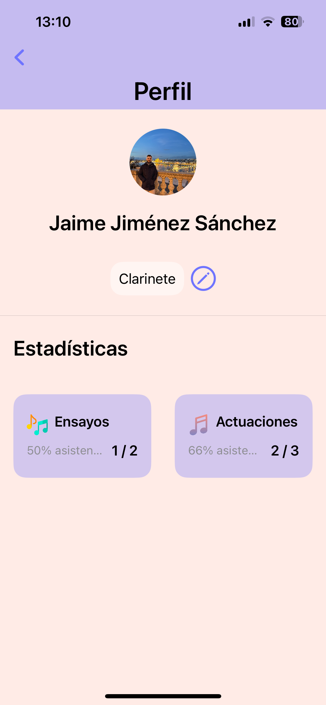

## Eventos

  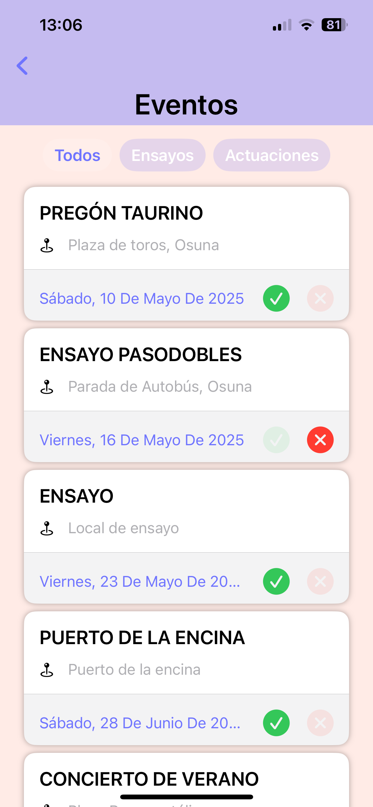
  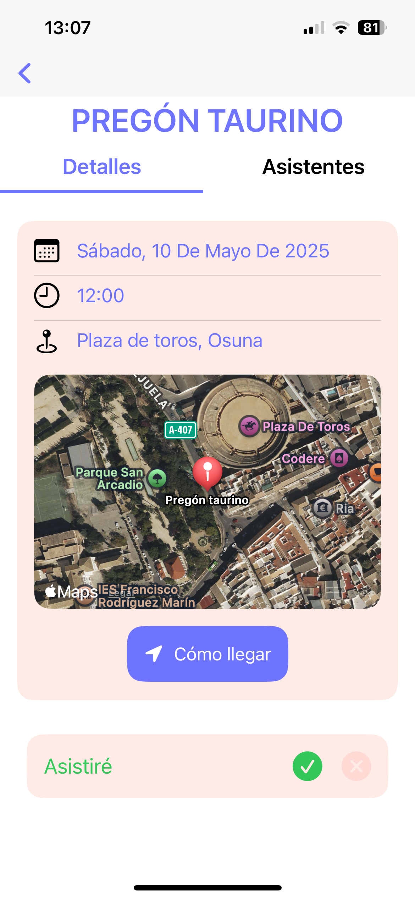
  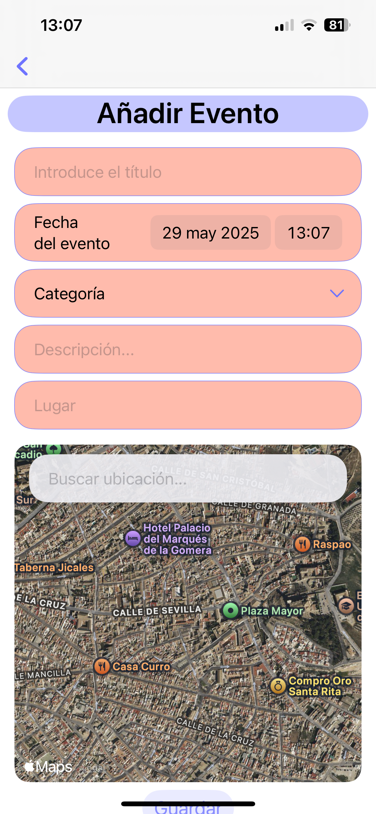

## Partituras
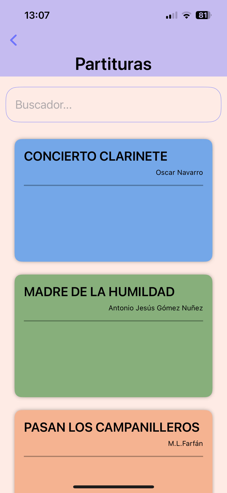

## Miembros
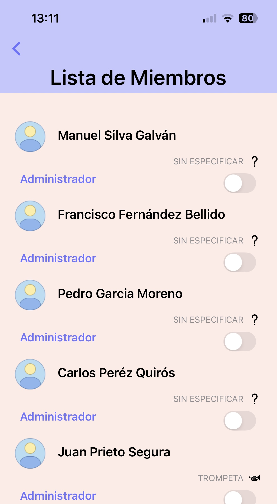

## Configuración
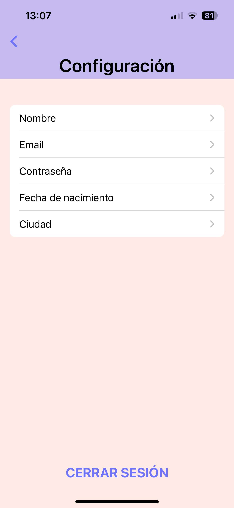

## Información
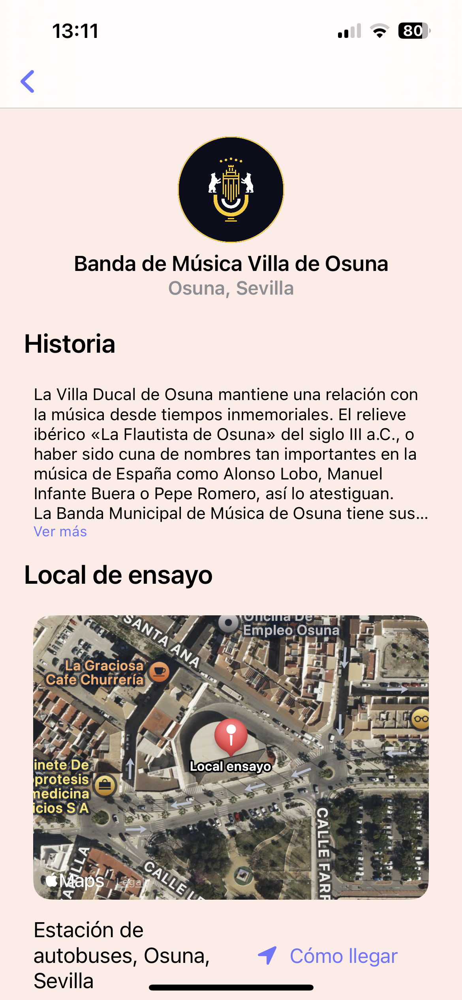

## Características

- Login y registro de usuarios.
- Visualización y creación de eventos, noticias y partituras.
- Gestión de perfiles.
- Menú desplegable intuitivo.
- Visualización de partituras musicales.
- Mapa interactivo.
- Sección de comentarios en las noticias.
- Estadísticas.

Abacco ha sido desarrollada con fines educativos para un proyecto final del ciclo Desarrollo de aplicaciones multiplataforma.

## Tecnologías

- Swift
- SwiftUI
- Firebase

## Contacto

Para dudas o sugerencias, contacta a [jaimejs1999@gmail.com](mailto:jaimejs1999@gmail.com).

## Aviso Legal

Esta aplicación y su código están protegidos por derechos de autor.

**Queda terminantemente prohibida la copia, distribución, modificación o cualquier uso no autorizado de esta aplicación sin permiso explícito del autor.**

**Copyright (c) 2025 Jaime Jiménez Sánchez. Todos los derechos reservados.**
